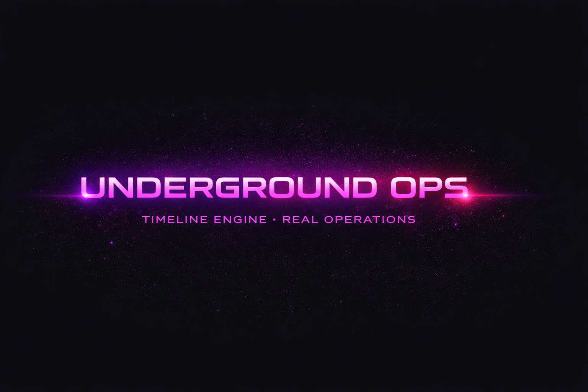

  

# 🖤 UNDERGROUND OPS — Timeline Engine

### Sistema di scheduling deterministico per operazioni reali

> _Il tempo non è un suggerimento._  
> **È un vincolo.**

---

## 🎯 Cos’è Underground Ops

**Underground Ops** è un **motore di timeline slot-based** progettato per gestire **operazioni reali**, non calendari generici.

Qui il tempo è:
- strutturato
- vincolato
- verificabile

Il sistema nasce per contesti dove **overlap, ambiguità e “tanto poi si aggiusta” non sono accettabili**.

---

## ⏱️ Modello temporale

🟣 **Slot-based timeline**

- unità di tempo fissa (`UNIT_MINUTES`)
- ogni blocco è definito da:
  - `tStart`
  - `duration`
- il DOM **non** è mai source of truth

✨ Benefici:
- collision detection affidabile  
- drag & resize prevedibili  
- creazione dei blocchi sempre valida  

---

## 🧠 Architettura (separazione reale delle responsabilità)

> _Ogni layer ha un ruolo preciso. Nessuna scorciatoia._

### 🖤 Controller — Orchestrazione
- stato runtime
- input utente
- drag / resize / create
- coordinamento generale

🔒 **Non genera DOM complesso**

---

### 🎨 UI Components — Rendering
- costruzione DOM
- layout dei blocchi
- micro-interazioni

🧼 **Nessuna logica di business**

---

### ⚙️ Utils — Fisica del sistema
- snapping
- collisioni
- normalizzazioni
- conversioni tempo ↔ pixel

🧠 **Funzioni pure**

---

### 💾 Storage — Persistenza
- salvataggio / recupero dati
- backend-ready
- indipendente dalla UI

---

## 👥 Gestione Staff

Ogni blocco timeline supporta:

- 👤 staff da database
- ⚡ staff rapido (temporaneo)
- 🏷 ruoli / skill opzionali

UI (strip, drawer, azioni) **isolata** dalla logica dati.

---

## 🚦 Regole operative

🔴 Il sistema **rifiuta** azioni non valide:

- durata minima garantita
- nessuna sovrapposizione
- creazione bloccata se non c’è spazio
- movimenti sempre validati

> Se non c’è spazio, **non si crea nulla**.

---

## 🧪 Stato del progetto

🟢 **Stabile e refactorizzato**

- controller drasticamente snellito  
- stato normalizzato  
- confini UI / logica rinforzati  
- comportamento deterministico sotto stress  

---

## 🖤 Filosofia Underground Ops

Questo progetto **non è generico per scelta**.

È pensato per:
- workflow complessi
- contesti reali
- sistemi che devono durare

---

## ✍️ Autore

**Salvatore Giacomazzo**  
Junior Fullstack Web Developer & Product Creator

